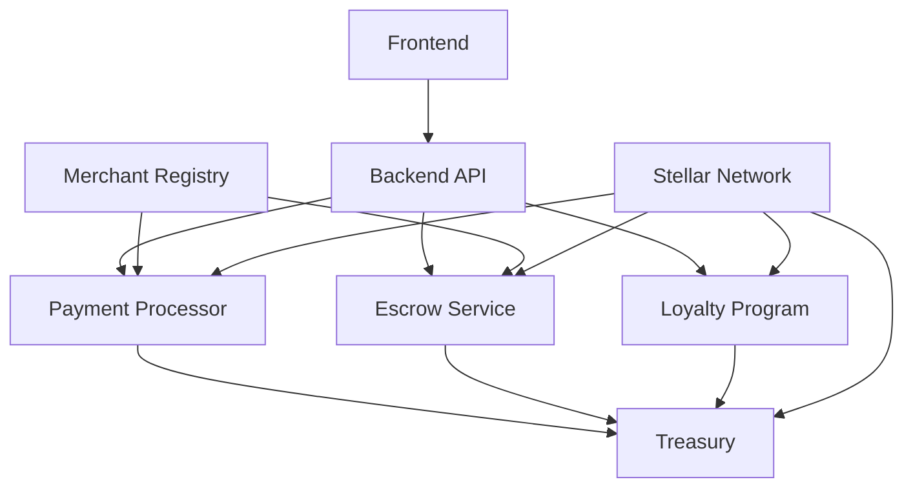

# 📋 StellarPOS Smart Contracts

Comprehensive Soroban smart contracts for StellarPOS payment processing, business logic, and financial operations on the Stellar blockchain.

## 🌟 Overview

StellarPOS Smart Contracts provide a complete suite of blockchain-based business logic for point-of-sale operations, including payment processing, escrow services, loyalty programs, and financial management.

## 🔧 Contracts Overview

### 💳 Payment Processor Contract
Core payment processing contract handling:
- **Multi-Asset Payments**: XLM and custom token support
- **Atomic Transactions**: Guaranteed payment execution
- **Fee Management**: Configurable transaction fees
- **Payment Verification**: Cryptographic proof of payment
- **Refund Processing**: Automated refund mechanisms

### 🔒 Escrow Service Contract
Secure escrow services for complex transactions:
- **Multi-Party Escrow**: Support for multiple parties
- **Time-locked Releases**: Automated time-based releases
- **Dispute Resolution**: Built-in arbitration system
- **Partial Releases**: Milestone-based payments
- **Emergency Recovery**: Admin recovery mechanisms

### 🎯 Loyalty Program Contract
Customer loyalty and rewards management:
- **Point Accumulation**: Earn points on purchases
- **Tier Management**: Customer loyalty tiers
- **Reward Redemption**: Points-to-value conversion
- **Expiration Handling**: Automatic point expiration
- **Bonus Campaigns**: Time-limited promotions

### 💰 Treasury Management Contract
Business treasury and financial operations:
- **Multi-signature Wallets**: Secure fund management
- **Automated Distributions**: Revenue sharing
- **Reserve Management**: Maintain operating reserves
- **Yield Generation**: Stake rewards integration
- **Financial Reporting**: On-chain audit trails

### 🏪 Merchant Registry Contract
Merchant onboarding and management:
- **Merchant Registration**: Decentralized merchant onboarding
- **KYC Integration**: Identity verification hooks
- **Fee Structure Management**: Per-merchant fee tiers
- **Status Management**: Active/inactive merchant states
- **Compliance Tracking**: Regulatory compliance monitoring

## 🛠️ Technology Stack

- **Smart Contract Platform**: Soroban (Stellar)
- **Programming Language**: Rust
- **Development Framework**: Soroban CLI
- **Testing Framework**: Soroban Test Framework
- **Documentation**: Cargo Doc
- **Deployment**: Stellar Testnet & Mainnet
- **Monitoring**: Stellar Expert integration

## 🏗️ Project Structure

```
contracts/
├── payment-processor/   # Core payment processing
│   ├── src/
│   │   ├── lib.rs      # Main contract logic
│   │   ├── types.rs    # Data structures
│   │   ├── storage.rs  # Storage management
│   │   ├── events.rs   # Event definitions
│   │   └── utils.rs    # Utility functions
│   ├── Cargo.toml
│   └── README.md
├── escrow-service/      # Escrow and dispute resolution
│   ├── src/
│   │   ├── lib.rs
│   │   ├── escrow.rs   # Escrow logic
│   │   ├── dispute.rs  # Dispute resolution
│   │   └── timelock.rs # Time-based releases
│   ├── Cargo.toml
│   └── README.md
├── loyalty-program/     # Customer loyalty system
│   ├── src/
│   │   ├── lib.rs
│   │   ├── points.rs   # Points management
│   │   ├── tiers.rs    # Tier system
│   │   └── rewards.rs  # Reward redemption
│   ├── Cargo.toml
│   └── README.md
├── treasury/           # Treasury management
│   ├── src/
│   │   ├── lib.rs
│   │   ├── multisig.rs # Multi-signature logic
│   │   ├── treasury.rs # Treasury operations
│   │   └── yield.rs    # Yield generation
│   ├── Cargo.toml
│   └── README.md
├── merchant-registry/  # Merchant management
│   ├── src/
│   │   ├── lib.rs
│   │   ├── registry.rs # Merchant registration
│   │   ├── kyc.rs      # KYC integration
│   │   └── fees.rs     # Fee management
│   ├── Cargo.toml
│   └── README.md
├── shared/             # Shared libraries
│   ├── src/
│   │   ├── lib.rs
│   │   ├── types.rs    # Common types
│   │   ├── utils.rs    # Shared utilities
│   │   └── errors.rs   # Error definitions
│   ├── Cargo.toml
│   └── README.md
├── scripts/            # Deployment and utility scripts
├── tests/              # Integration tests
└── docs/               # Documentation
```

## 🚀 Quick Start

### Prerequisites
- Rust 1.70+
- Soroban CLI
- Stellar CLI
- Git

### Installation

```bash
# Clone the repository
git clone https://github.com/StellarPOS-App/contracts.git
cd contracts

# Install Soroban CLI (if not installed)
cargo install --locked soroban-cli

# Build all contracts
make build

# Run tests
make test

# Deploy to testnet
make deploy-testnet
```

### Environment Setup

```bash
# Setup Stellar testnet
soroban config network add testnet \
  --rpc-url https://soroban-testnet.stellar.org:443 \
  --network-passphrase "Test SDF Network ; September 2015"

# Generate test identity
soroban config identity generate alice
soroban config identity address alice

# Fund test account
soroban config identity fund alice --network testnet
```

## 📋 Contract Functions

### Payment Processor

```rust
// Initialize payment processor
pub fn initialize(env: Env, admin: Address, fee_rate: u32) -> Result<(), Error>

// Process payment
pub fn process_payment(
    env: Env,
    payer: Address,
    merchant: Address,
    amount: i128,
    asset: Address,
    memo: String
) -> Result<u64, Error>

// Verify payment
pub fn verify_payment(env: Env, payment_id: u64) -> Result<PaymentStatus, Error>

// Process refund
pub fn process_refund(
    env: Env,
    payment_id: u64,
    refund_amount: i128,
    reason: String
) -> Result<u64, Error>
```

### Escrow Service

```rust
// Create escrow
pub fn create_escrow(
    env: Env,
    buyer: Address,
    seller: Address,
    amount: i128,
    asset: Address,
    terms: EscrowTerms
) -> Result<u64, Error>

// Release funds
pub fn release_funds(env: Env, escrow_id: u64) -> Result<(), Error>

// Raise dispute
pub fn raise_dispute(
    env: Env,
    escrow_id: u64,
    reason: String
) -> Result<(), Error>

// Resolve dispute
pub fn resolve_dispute(
    env: Env,
    escrow_id: u64,
    resolution: DisputeResolution
) -> Result<(), Error>
```

### Loyalty Program

```rust
// Register customer
pub fn register_customer(env: Env, customer: Address) -> Result<(), Error>

// Award points
pub fn award_points(
    env: Env,
    customer: Address,
    points: u64,
    transaction_id: String
) -> Result<(), Error>

// Redeem points
pub fn redeem_points(
    env: Env,
    customer: Address,
    points: u64
) -> Result<i128, Error>

// Get customer tier
pub fn get_customer_tier(env: Env, customer: Address) -> Result<CustomerTier, Error>
```

## 🧪 Testing

```bash
# Run all tests
make test

# Run specific contract tests
cargo test -p payment-processor

# Run integration tests
cargo test --test integration

# Test with coverage
cargo tarpaulin --out Html

# Benchmark tests
cargo bench
```

## 🚀 Deployment

### Testnet Deployment

```bash
# Deploy all contracts to testnet
make deploy-testnet

# Deploy specific contract
soroban contract deploy \
  --wasm target/wasm32-unknown-unknown/release/payment_processor.wasm \
  --network testnet \
  --source alice
```

### Mainnet Deployment

```bash
# Build optimized contracts
make build-release

# Deploy to mainnet
make deploy-mainnet

# Verify deployment
soroban contract invoke \
  --id CONTRACT_ID \
  --network mainnet \
  --source alice \
  -- get_version
```

## 🔐 Security Features

### Access Control
- **Role-based Permissions**: Admin, merchant, customer roles
- **Multi-signature Support**: Secure admin operations
- **Time-lock Mechanisms**: Delayed sensitive operations
- **Emergency Pause**: Circuit breaker functionality

### Financial Security
- **Overflow Protection**: Safe arithmetic operations
- **Reentrancy Guards**: Prevent reentrancy attacks
- **Input Validation**: Comprehensive parameter checking
- **Rate Limiting**: Transaction frequency controls

### Audit Trail
- **Event Logging**: Comprehensive event emission
- **State Tracking**: Complete state change history
- **Transaction Receipts**: Cryptographic proofs
- **Compliance Reporting**: Regulatory compliance data

## 📊 Contract Interactions



## 📚 Documentation

- [Contract Architecture](./docs/architecture.md)
- [API Reference](./docs/api.md)
- [Integration Guide](./docs/integration.md)
- [Security Guidelines](./docs/security.md)
- [Deployment Guide](./docs/deployment.md)
- [Troubleshooting](./docs/troubleshooting.md)

## 🤝 Contributing

1. Fork the repository
2. Create a feature branch (`git checkout -b feature/amazing-feature`)
3. Make your changes
4. Add tests for new functionality
5. Run the test suite (`make test`)
6. Commit your changes (`git commit -m 'Add some amazing feature'`)
7. Push to the branch (`git push origin feature/amazing-feature`)
8. Open a Pull Request

## 📄 License

This project is licensed under the MIT License - see the [LICENSE](LICENSE) file for details.

## 🔗 Links

- [Frontend Repository](https://github.com/StellarPOS-App/surface)
- [Backend Repository](https://github.com/StellarPOS-App/backend)
- [Soroban Documentation](https://soroban.stellar.org/)
- [Stellar Developer Portal](https://developers.stellar.org/)

---

Built with ❤️ for the Stellar ecosystem